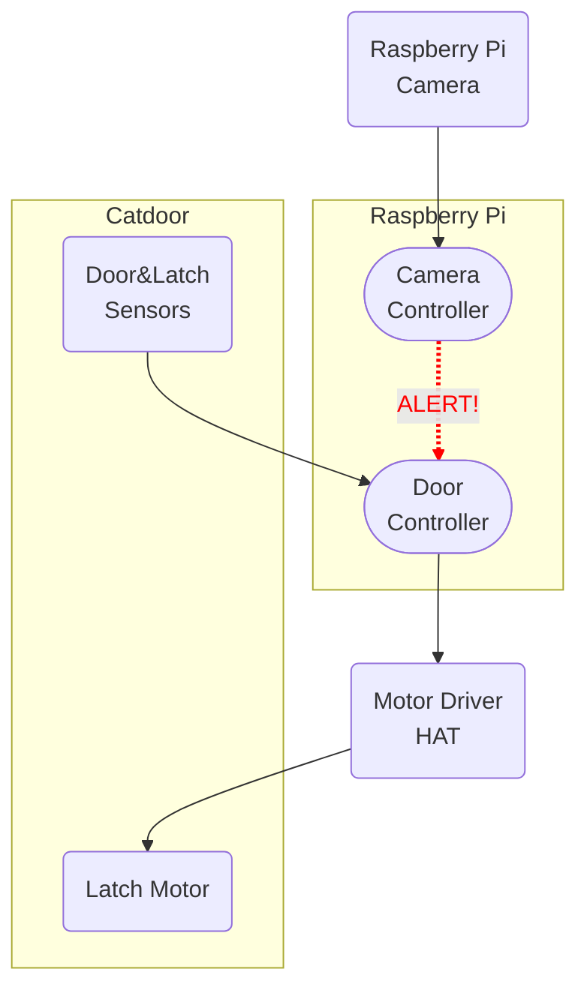

My cat likes to bring live rodents and birds into the house via her cat door.  In this series of posts I'll document my solution to this problem, which incorporates:

  - A fancy RFID-enabled catdoor that I ordered online (heavily modified),
  - A Raspberry Pi with camera, motor driver, and other accessories,
  - Machine learning using the Keras and Tensorflow libraries,
  - And a custom Python application to control everything.

This is not an original idea -- I've seen similar projects as far back as 2002.
Mine was implemented in 2016, but not documented until now (2023).  My intention
is to walk through every aspect of the hardware, software, design goals and
implementation process in great detail.

  
Table of Contents

  [[TOC]]

## Background and history

(If you're not interested in the "why", you may want to
[skip to the next section](#the-plan).)

Back in 2010 when we adopted Isabelle, she quickly became an indoor/outdoor cat
for various reasons (mostly, young kids who couldn't stop her from getting
out).  Since the shelter told us she was microchipped and I love gadgets, I
ordered a fancy cat door that can read microchips and only allows authorized cats
to enter, the
["Cat Mate Elite Super Selective"](https://closerpets.com/collections/cat-flaps/products/elite-microchip-flap-timer-control). ^[Here's a bunch more I could say about this. I could go on and on and on, really!]

It's a really nice cat door and it's been operating reliably for 12+ years. xxxxxxxxxxxxxxxxxxxxxxxxxxxxxxxxxxxxxxxxxxxxxxxxxxxxxxxxxxxxxxxxxxxxxxxxxxxxxxxxxxxxxxxxxxxx

^[More thoughts [here](https://www.google.com)] Unfortunately, I hadn't done quite enough research -- the door doesn't actually
recognize US microchips.

> This is a thing
> that I said

Luckily, it also came with a set of plastic RFID tags
that could be attached to the cat's collar!

Unfortunately, Isabelle 
continually lost her breakaway collars outside, along with her tags.

So, I gave up on the RFID feature (and cat collars) entirely.  I taped the remaining RFID tag near
the door's opening so it could always be detected, at which point I essentially had
a very expensive dumb cat flap.

There was still some
residual benefit due to the way the door operates:  Whenever my cat (or any
animal!) pushed on the door in an attempt to open it, a mechanical locking pin
was disengaged by a small but loud electric motor.  Isabelle was used to the noise,
but it was enough to startle any curious wildlife or neighbor cats (except on
one memorable occasion). Also, it kept track of the last direction the door was
opened, which was occasionally useful if I wanted to know whether Isabelle was in or
out.

This operated well enough for several years.  Then Isabelle began to develop her
hunting skills. The pattern goes like this:

* Humans are boring.  They need more excitement in their lives!
* At enormous personal risk, catch interesting critter outside.
* Bring live, mostly unharmed gift inside for humans to admire!  (She almost never does this when we aren't home -- it's all about the audience.)
* Release toy in house.
* Attempt to play with new friend, resulting in up to 30 seconds of fun!
* Sneaky critter hides under something or flies on top of something and can't be found without effort.
* Boooring! Lose interest and go take a nap.
* Silly humans spend the rest of the afternoon yelling and moving furniture.

This kind of thing became more and more frequent over the years. We discussed making
her an indoor-only cat, but we were very nervous about forcibly changing her bathroom
habits (multiple UTIs, ruined couches, intermittent patterns of litter box use...
don't ask.) Occasionally my wife half-jokingly, half-desperately suggested I should
engineer a solution, but I never did more than a bit of Googling.

Around the fall of 2016, the pace picked up and it became intolerable.  She was
bringing us as many as 4-6 "presents" each week. Clearly something had to change.
I decided to commit to the project.

## The plan

<object data="/static/img/diagram-full.svg" width="100%" alt="Diagram" style="pointer-events: none;"></object>

[Catcierge](https://joakimsoderberg.github.io/catcierge/)

[cvFlap](https://lmb.informatik.uni-freiburg.de/people/ronneber/cvflap/)

[Integrated Cat Flap](https://forums.raspberrypi.com/viewtopic.php?t=172114&sid=8740cc9928121be139dc8f4320d24792)

[Mousehunter](https://towardsdatascience.com/keep-your-home-mouse-free-with-an-ai-powered-cat-flap-a67c686ce394)

[Flo Control](https://web.archive.org/web/20111011164131/http://www.quantumpicture.com/Flo_Control/flo_control.htm)

[Product page](https://closerpets.com/collections/cat-flaps/products/elite-microchip-flap-timer-control)
