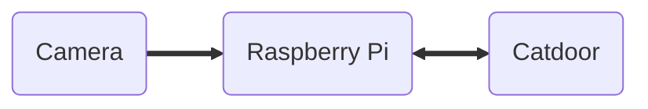

## Introduction

My cat likes to bring live rodents and birds into the house via her cat door.  In this series of posts I'll document my solution to this problem, which incorporates:

  - A fancy RFID-enabled catdoor that I ordered online (heavily modified),
  - A Raspberry Pi computer with camera, motor driver, and other accessories,
  - Image recognition using the Keras and Tensorflow libraries,
  - All controlled by a custom Python application.

This is not an original idea --- I've seen similar projects as far back as 2002.
^[Some projects that inspired me:
[Flo Control](https://web.archive.org/web/20111011164131/http://www.quantumpicture.com/Flo_Control/flo_control.htm),
[cvFlap](https://lmb.informatik.uni-freiburg.de/people/ronneber/cvflap/), and
[Catcierge](https://joakimsoderberg.github.io/catcierge/).  Later related projects: 
[Integrated Cat Flap](https://forums.raspberrypi.com/viewtopic.php?t=172114&sid=8740cc9928121be139dc8f4320d24792),
[Mousehunter](https://towardsdatascience.com/keep-your-home-mouse-free-with-an-ai-powered-cat-flap-a67c686ce394),
[This one on YouTube](https://www.youtube.com/watch?v=1A-Nf3QIJjM&t=2s&ab_channel=IgniteSeattle)
]
Mine was implemented in 2016, but not documented until now (2022).  My intention
is to walk through every aspect of the hardware, software, design goals and
implementation process in detail.

## The cat and the door

Story time!  If you're not interested in the "why", you may want to
[skip ahead](#the-plan).

{.mx-auto width=500}

Back in 2009 when we adopted Isabelle, she quickly became an indoor/outdoor cat,
for various reasons.
Since the shelter told us she was microchipped and I love tech gadgets, I
ordered a fancy cat door
^[The ["Cat Mate Elite Super Selective" {width=250px} ](https://closerpets.com/collections/cat-flaps/products/elite-microchip-flap-timer-control)]
that will read microchips and only allow authorized cats to enter.

It's a well-made device and it's been operating reliably for 12+ years.

Unfortunately, I hadn't done enough research --- the door doesn't actually
recognize US microchips.

Luckily, it also came with a set of plastic RFID tags
that could be attached to the cat's collar!

Unfortunately, Isabelle 
continually lost her breakaway collars outside, along with her tags.

So, I gave up on the RFID feature (and cat collars) entirely.  I taped the remaining RFID tag near
the door's opening so it could always be detected, at which point I essentially had
a very expensive dumb cat flap.

There was still some
residual benefit due to the way the door operates:  Whenever my cat (or any
animal!) pushed on the door in an attempt to open it, a mechanical locking pin
was disengaged by a small but loud electric motor.  Isabelle was used to the noise,
but it was enough to startle any curious wildlife or neighbor cats.
Also, it kept track of the last direction the door was
opened, which was occasionally useful if I wanted to know whether Isabelle was in or
out.

## The reign of terror

{.mx-auto width=600}

This operated well enough for several years.  Then Isabelle began to show off her
hunting skills. I imagine in her little cat brain it goes something like this:

* Humans are boring.  They need more excitement in their lives!
* At enormous personal risk, catch interesting critter outside.
* Bring live, mostly unharmed gift inside for humans to admire! (She almost never does this when we aren't home --- it's all about the audience.)
* Release toy in house.
* Attempt to play with new friend, resulting in up to 30 seconds of excitement!
* Sneaky critter hides under something or flies on top of something and can't be found without effort.
* Boooring! Lose interest and go take a nap.
* Silly humans spend the rest of the afternoon yelling and moving furniture.

{.inline width=220}
{.inline width=220}
{.inline width=220}
{.text-center}

This kind of thing became more and more frequent over the years. We discussed making
her an indoor-only cat, but we were very nervous about forcibly changing her bathroom
habits ^[Due to multiple UTIs, intermittent litter box use, and several ruined couches.]
. Occasionally my wife half-jokingly, half-desperately suggested I should
engineer a solution, but I never did more than a bit of Googling.

Around the fall of 2016, the pace picked up and it became intolerable.  She was
bringing in as many as 4-6 "presents" each week. Clearly something had to change.
Out of frustration and desperation, I decided to dive in and commit my free time
to the problem, and I'm glad I did --- it turned into an extremely rewarding and
educational little project.  As a bonus, it actually works!

## The plan

At this point in time (2016) I had done some small experiments with Raspberry Pi
^[The
[Raspberry Pi](https://www.raspberrypi.com/products/raspberry-pi-3-model-b-plus/)
is a small, cheap computer marketed at hobbyists.
{.!my-0}
I picked it for this project
because it has a very capable camera interface and a large number of General Purpose Input / Output (GPIO) pins, which allow the Pi to control and sense external
circuits. Later posts will discuss the Pi in detail.
]
and its
camera module, so that seemed like a logical starting point.  The existing
catdoor gave me physical sensors and a locking mechanism, already well-engineered.
I had zero experience with machine learning and no idea if the Pi would be powerful
enough for my application, but the basic skeleton of the idea was conceptually
simple:

* Come up with a way for the Pi to control the catdoor.
* Somehow have the Pi recognize when Isabelle attempts to bring in an extra guest.
* When she does, don't unlock the door!

{.mx-auto width=500}

Within this basic skeleton, there are many possible variations.
Should we attempt to recognize Isabelle, and thus keep out other animals?
Or should we focus on recognizing "contraband" (rodents and birds)?
Can all processing take place on the Pi, or should we leave the computationally
difficult machine vision problem to another computer?  How should the system react
to indeterminate, hard-to-identify images?  Should we stay locked until we have
definitely identified "Isabelle without contraband", or stay unlocked by default
until we detect bad behavior?  When we detect a critter and enter "lockdown", how
do we return to normal?

## Requirements

I spent a lot of time thinking about these issues, and eventually came up with
a set of requirements and constraints that influenced my implementation choices.
There are two broad, overarching requirements:

* **Safe:**  For me this means that I want the system to err on the side of
allowing Isabelle into the house if anything goes wrong, or when
the system can't make an accurate identification.  Isabelle occasionally encounters
dangers such as wildlife or other cats, and retreats into the house at high speed.  I
don't want to jeopardize that!
* **Effective:**  The system should be able to actually stop Isabelle from entering
with a critter in her mouth!

The second requirement may seem obvious, but it's worth stating explicitly, because
these two requirements are often in conflict with each other.
For example, a system that takes a long time to
analyze each image may be unsafe if it is normally locked, or ineffective if it is
normally unlocked.

{.mx-auto width=400}

With the two meta-requirements in mind, I decided on some more specific
implementation requirements:

* **Normally locked:**  Ideally, I want the door to continue to operate roughly
the way it always has.  It should stay locked until Isabelle pushes on it, and only
then unlock (assuming she isn't trying to smuggle something in).
* **Unlock immediately:**  Unless the system has concluded that the cat is
trying to bring in a critter, it should *immediately* unlock when she pushes on the
door.  There should be no additional processing delay.
* **Timed lockout:**  When a "bad" image is detected and we think kitty is up to no
good, the system should enter a short "lockout" period, during which we will refuse
to unlock when she pushes on the door.  Each time a new "bad" image is seen, we will
restart the lockout timer.  A short lockout timer will minimize the safety impact of false
positive events (where the system mistakenly classifies a single image as "bad".)
* **Sub-second response time:**  The system should be able to analyze a new image at
least once per second --- ideally more like 5 times per second.  If image processing
takes too long, the cat may reach the door with contraband before analysis is
complete, and the "unlock immediately" policy would always allow her in.
^[Also, the lockout time must be at least as long as the response
time, so shorter reponse times give more flexibility in lockout time.]
* **Local processing only:**  I wasn't 100% certain I could acheive this, but my goal
was to keep all decision-making on the Pi.  If I discovered that it wasn't powerful
enough, my fallback plan was to outsource image recognition to a larger computer in
my home.  Under no circumstances would I rely on the cloud.
^[My motivation here was safety --- I don't want the system to be dependent on
internet service that might be interrupted, or other people's computers that might
be slow to respond.]
* **Ignore ambiguous/unexpected results:**  Only an unambiguously "bad" image
(Isabelle with a victim) should trigger
lockout.  *Anything* else --- my cat without a critter, my cat without a clear view
of her mouth, the neighbor's cat, a curious fox, an image with nothing but the
ground outside the door, a UFO, etc. --- should be treated as a "good" image, and
not trigger the lockout.

## Next step

It's great to have a firm vision for where a project should go, but none of these
goals and requirements will mean anything if we can't figure out how to actually
control the existing cat door!  In the next post we'll do a detailed teardown and
analysis of the Cat Mate Elite Super Selective, to answer these questions:

- How does it lock and unlock?
- How does it know when to unlock?
- How can we control it from the Raspberry Pi?
