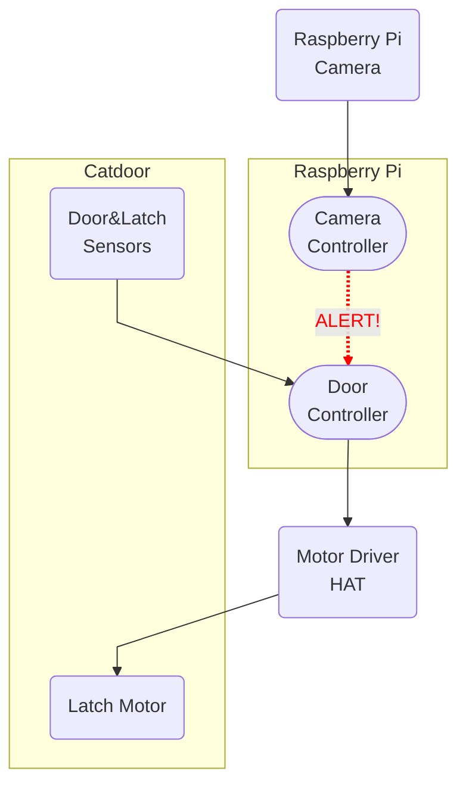

## Introduction

My cat likes to bring live rodents and birds into the house via her cat door.  In this series of posts I'll document my solution to this problem, which incorporates:

  - A fancy RFID-enabled catdoor that I ordered online (heavily modified),
  - A Raspberry Pi computer with camera, motor driver, and other accessories,
  - Image recognition using the Keras and Tensorflow libraries,
  - All controlled by a custom Python application.

In the [first post in this series](/posts/kittypi-part1-intro), I
described the general approach, as well as some of the design goals
I set for myself.  In this post we'll get a bit more technical as we take apart
the existing cat door to see how it works.

## Preparation

The subject of this post is the
["Cat Mate Elite Super Selective"](https://closerpets.com/collections/cat-flaps/products/elite-microchip-flap-timer-control)
cat door, installed in a ground level window of my basement for seven years at
the time this project began.

{.mx-auto width=600}

It worked --- it opened, it closed, it locked, it unlocked.  It sensed when something
was pushing on the flap and it knew if they were trying to get in or get out.  But
how exactly did it do these things, and could we control these functions from the
Raspberry Pi?

The heart of the CatMate door is a central control board which I'd seen many
times --- it's exposed whenever you change the batteries.  From this central
board a number of wires head off to parts unknown.  My hope was that I could
determine the function of each wire, disconnect it from the CatMate's controller,
and instead connect it to a Raspberry Pi computer that I could program.
^[Possibly I could instead have attempted to connect the Pi to a serial or debug port of
the CatMate, reprogrammed the CatMate's firmware, and somehow enabled the Pi to
remotely command the CatMate's microcontroller.  I did not investigate this option.]

{.mx-auto width=550}

At the time I was a bit nervous about disassembling (and then modifying) this
catdoor --- I needed it to continue working so Isabelle could get in and out!
^[And it was not cheap.]
There was also no certainty that the project would work at all.  Any number of
roadblocks were possible:

* The various control wires might use a voltage or signaling method incompatible with the Pi.
* The Pi might not have the CPU power required for the image processing task.
* Even if I used an external computer, it might not be possible to design and train
an algorithm to reliably recognize problem images.
* I might not be able to figure out the internal workings of the CatMate.
* I might break something.

Due to all this uncertainty, I proceeded very slowly and cautiously.  I tried to
ensure sure I could always put the door back in operation if I had to abort or
rethink the project.

With the benefit of hindsight, however, let's pretend I knew exactly what I was
doing and dive right into results of the disassembly.

## Overview

By removing a few screws, we can remove the entire front cover to reveal the inner workings:

{width=600}

1. Control board with 12 wires leading out
2. 4xAA batteries (~6V, promisingly close to the Pi's 5V I/O voltage)
3. Hinges (the left hinge contains a mystery sensor that we'll discuss later)
4. Latch motor assembly that moves the latch pins up and down as indicated
5. Centering magnets
6. Flap position sensors and magnet
7. Clear flap
8. RFID antenna loop (ignored, since I have no intention of using this feature)

Let's examine some of these components in more detail.

## Position Sensors

The way the door latch and the position sensors work together is really interesting:

{.mx-auto width=600}

1. These slots in the flap accept..
2. ...these latch pins, but there is a bit of play, allowing the flap to swing a
few degrees inward or outward even when it is locked.
3. These two magnets attract each other and keep the flap perfectly centered,
unless something pushes on it.
4. This magnet activates...
5. ...these two carefully placed
[magnetic reed switches](/https://en.wikipedia.org/wiki/Reed_switch),
which together allow the controller to detect whether the flap is centered,
pushed slightly inward, or pushed slightly outward.

With a bit of careful attention and probing with a voltmeter, we can figure out how
to interpret the reed switches.  Each switch is normally closed by spring tension,
meaning that it will
conduct electricity when the magnet is **not** close by.  In this situation the black
ground wire is shorted to the colored sense wire, forcing it to 0V.  When the magnet
**is** close enough,
^[In a quiet room, you can actually hear the faint click as the switch opens or
closes when the magnet moves into or out of range.]
it pulls the ground and sense wires apart, allowing the
[pull-up resistor](https://en.wikipedia.org/wiki/Pull-up_resistor) in the control
board to bring the sense wire up to 5V.

{.mx-auto width=500}

In this view of the reed switches, we can see that they are mounted in parallel,
diagonal grooves, slightly offset from one another.  The one on the left (**Orange**
wire) activates ^[i.e. opens, i.e. reads 5V] when the flap is perfectly centered.
The one on the right (**Yellow** wire) activates when the door is pushed slightly **in**.
When the door is pushed slightly **out**, neither switch activates.

It's astonishing to me that these components can be placed and calibrated so
precisely that just a few degrees of movement can be **reliably** detected.

Embedded in the left-hand hinge assembly is another magnet paired with another reed
switch:

{.mx-auto width=400}

The reed switch is mounted inside the support bracket (shown temporarily
unmounted from the base), while the magnet is embedded into the pivot pin of
the flap itself.

I have no idea what this sensor is for.  I spent a little time on it, probing
with my voltmeter while moving the flap into various positions, but I never saw
it change voltage.  I probably could have figured it out with more effort, but
I decided that I don't really *care*.  The two switches discussed earlier tell us
everything we need to know:

* **Orange HIGH, Yellow LOW**: Flap is centered, nothing happening.
* **Orange LOW, Yellow HIGH**: Kitty (or something) is pushing *inward* on the
flap.  She can't actually get in unless we run the motor to open the latch.
* **Orange LOW, Yellow LOW**: Kitty is pushing *outward* on the
flap.  It's fine if she wants to smuggle critters *out* of the
house, so we should unlock the door unconditionally.
* **Orange HIGH, Yellow HIGH**: Not relevant.
^[This does happen briefly when the door is pushed
*ever so slightly* inward.  But we can ignore this case in practice --- we don't
care about the state of the **Yellow** wire unless the flap is not centered
(**Orange** wire is LOW).]

{.mx-auto width=500}

## Motor Assembly

The latch motor assembly has two jobs:

* **Move** the latch pins into the locked (up) or unlocked (down) positions.
* **Sense** when the latch pins are in the locked or unlocked positions.

To accomplish this, a single motor drives two gears.  Each gear turns at the
exact same rate.  One of the gears connects to the latch pins and drives them
up and down.  The other connects to a sensor which can monitor the
position of *both* gears.

1. Motor connected to shaft and worm gears.  The
[worm gears](https://en.wikipedia.org/wiki/Worm_drive)
turn the high-speed rotation of the motor into lower-speed (but more powerful) motion
of the two toothed gears.
^[Probing with a voltmeter shows that this motor is simply
driven directly from the battery voltage (5V-6V).  This should make Raspberry Pi
control fairly simple.]
2. Toothed gear that rotates the alignment plate.
3. Toothed gear that moves the latch pin plate up and down via a
[cam](https://en.wikipedia.org/wiki/Cam)
(small off-centered plastic nub that's hard to see in these photos).  Because these
two gears have the same number of teeth, their rotations are exactly synchronized.
4. Photo interrupter (more on this below).
5. Alignment plate.  This half-circle of plastic rotates through the center of the photo interrupter.  For half of its rotation it blocks the gap in the interrupter,
and for the other half it leaves it unblocked.
6. Latch pin plate.  This moves up and down as the cam moves in a circular motion.

If we watch the alignment plate and latch pin plate moving as the controller locks
and unlocks the door, we can make some observations:

* The motor always turns in the same direction.  It doesn't rotate one way to lock
and the other way to unlock.
* This results in a continuous up, down, up, down motion of the latch pin plate, and
continuous rotation of the alignment plate.
* The Latch Pins reach the fully-up (locked) position *just* as the Alignment Plate
*exits* the gap in the photo interrupter.  In other words, the door is locked just when the interrupter
goes from **blocked** to **unblocked**.
* The latch pins reach the fully-down (unlocked) position *just* as the alignment
plate *enters* the gap in the interrupter, so the door is fully
unlocked just when the interrupter goes from
**unblocked** to **blocked**.

The photo interrupter took some research to figure out.  It's clear that it has to
be some type of optical device where light is either blocked, or not blocked, by the
alignment plate.  If we watch the alignment plate and latch pin plate move when the
controller locks and unlocks the door, we can make

<object data="/static/img/diagram-original.svg" width="100%" alt="Diagram" style="pointer-events: none;"></object>