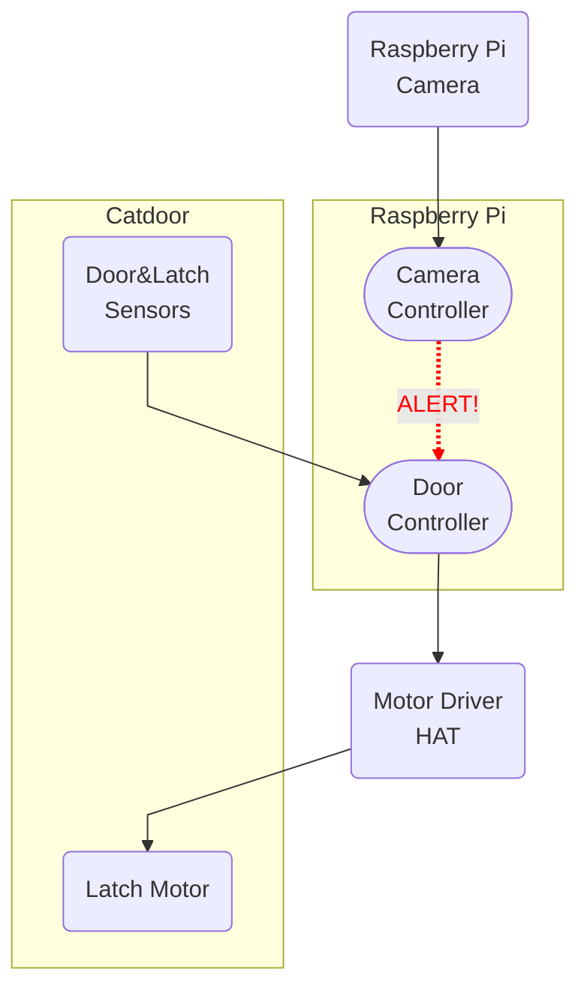

## Introduction

My cat likes to bring live rodents and birds into the house via her cat door.  In this series of posts I'll document my solution to this problem, which incorporates:

  - A fancy RFID-enabled catdoor that I ordered online (heavily modified),
  - A Raspberry Pi computer with camera, motor driver, and other accessories,
  - Image recognition using the Keras and Tensorflow libraries,
  - All controlled by a custom Python application.

<object data="/static/img/diagram-full.svg" width="100%" alt="Diagram" style="pointer-events: none;"></object>
